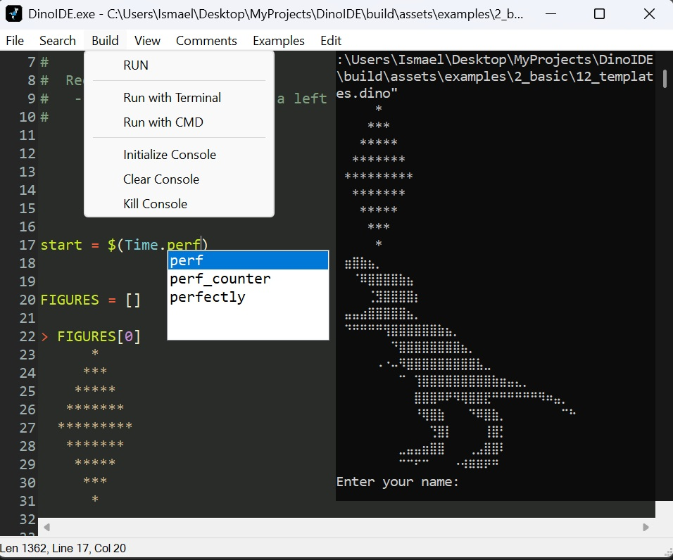

## INFO
   A minimalist and lightweight editor for DinoCode. Full support for DinoScripts syntax highlighting and execution.

## GUI
   > 
 

## Credits
* Me ([BlassGO](https://github.com/BlassGO))
* G33kDude (RichCode) 
* just me (Some additional functions that I adapted to RichCode)
* AHK Community (Powered some additional features)

## License
> **DinoIDE** is distributed under the GNU General Public License version 2.0 (GPLv2). This means that anyone can use, modify and distribute the software as long as they comply with the terms of the license.

> **DinoCode** (the programming language) has its own separate license. For information about DinoCode's license terms, please visit the [official repository](https://github.com/dinocode-lang/dinocode).

  **->** See the [LICENSE](LICENSE ':ignore') file for more information on DinoIDE's license terms and conditions.
