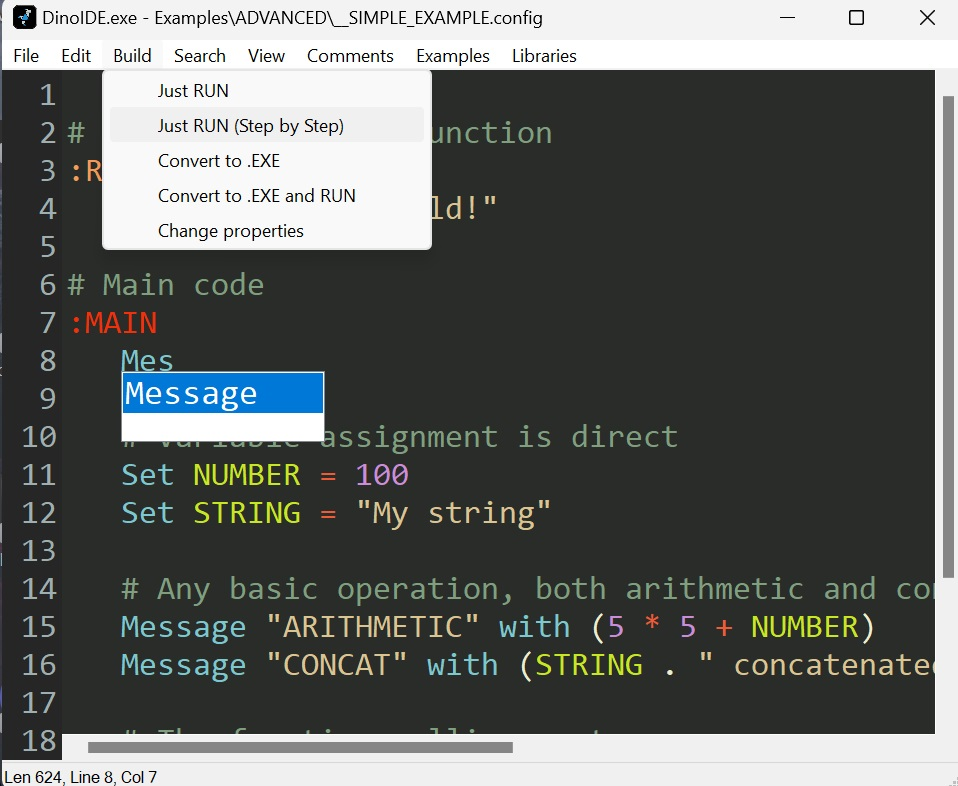

## INFO
   Official Editor of DinoCode. Full support for DinoScripts syntax highlighting, execution, standard conversion (.EXE) and basic utilities. Current replacement for DinoCompiler, it integrates it with support for the most recent changes.

## GUI
   > 
 

## Credits
* Chris Mallett (AHK2EXE)
* G33kDude (RichCode) 
* just me (Some additional functions that I adapted to RichCode)
* AHK Community (Powered some additional features)

## License
> DinoIDE is distributed under the GNU General Public License version 2.0 (GPLv2). This means that anyone can use, modify and distribute the software as long as they comply with the terms of the license.

  **->** See the [LICENSE](LICENSE ':ignore') file for more information on the license terms and conditions.
